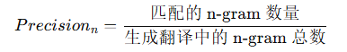
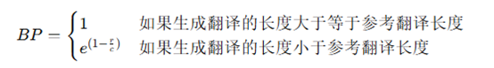
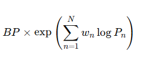

# Translation-Evaluation
Through n-gram ,precision and Brevity Penalty    
## Question:     
在NLP领域存在这样一种评价机器翻译结果质量的算法，它通过比较机器翻译输出和人类参考翻译之间的匹配度来计算翻译质量。它主要考虑n-gram的匹配率，以及短句惩罚以防止机器生成过短的翻译。            

n-gram 匹配：通过计算机器翻译结果和参考翻译中 n-gram（词的连续序列，详细解释可以百度~）的重叠来评估翻译的质量。常用的 n-gram 范围从 1 到 4（即 1-gram 是单个词的匹配，2-gram 是两个连续词的匹配，等等）。    

精度（Precision）：对于每个 n-gram，计算机器翻译中 n-gram 与参考翻译中 n-gram 的匹配率。         
      

短句惩罚（Brevity Penalty, BP）：如果生成的句子长度远短于参考句子，会进行惩罚，避免模型生成过短的翻译。公式如下:其中，r 是参考翻译的长度，c 是生成翻译的长度。                         
     

整体公式：最终的分数通过结合不同 n-gram 的精度（通常是 1-gram 到 4-gram）和短句惩罚来计算：其中w_n是不同 n-gram 的权重（通常平均分配，如每个 w_n=1/N），P_n是对应 n-gram 的精度。         
       

现在请你计算一下给定的机器翻译输出（translation_result.text）和人类翻译结果（reference.txt）的平均加权（即w_n=1/N）分数。给定的文本可以用空格进行分词。txt文件里面包含很多行数据，逐行计算分数最后取均值即可。           

一个样例：         
translation_result：'the', 'cat', 'is', 'in', 'the', 'mat'          
reference：'the', 'cat', 'is', 'on', 'the', 'mat'             
平均加权分数：0.5946              

## Current Work     
(1)Coded all mathematical formulas       

## Current Problem     
(1)Ways to divide sentences are not perfect, needing improvements   
